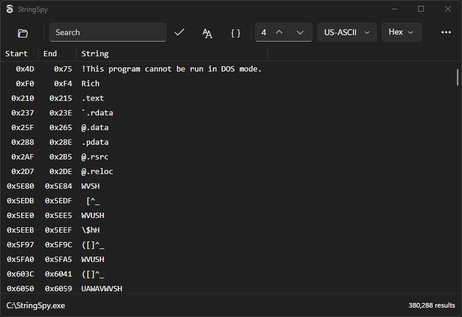
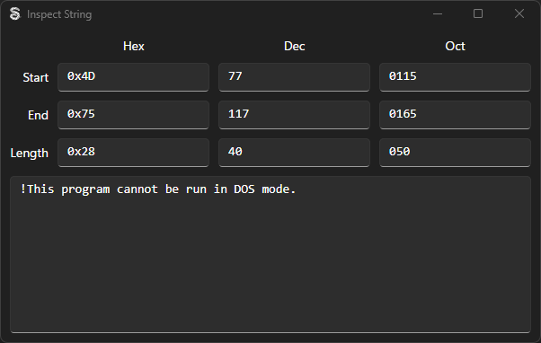

# StringSpy

**StringSpy** is cross-platform GUI tool for finding strings in binary data, similar to the GNU command-line `strings` program. StringSpy supports finding strings in multiple encodings (e.g. Unicode), filtering results using regex, and exporting results.

## Download
[Download the latest release](releases/latest)

## Screenshots

